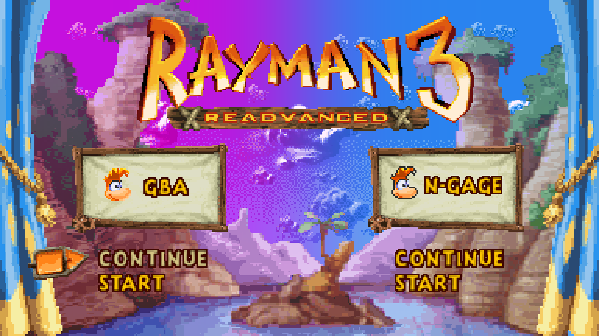
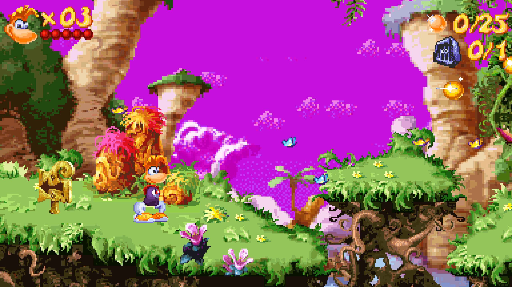
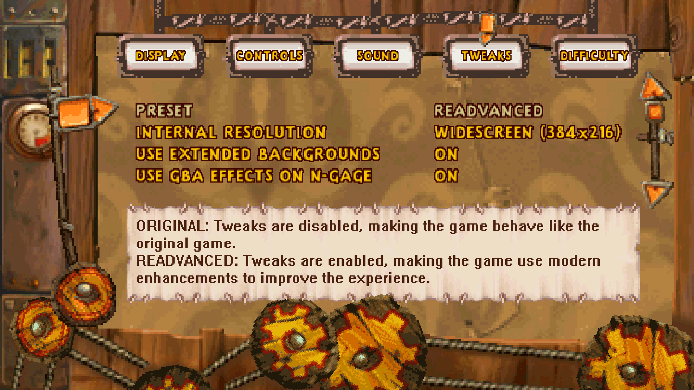
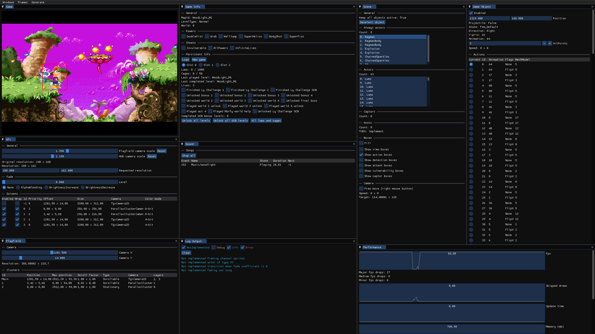

# Rayman 3 Readvanced

> [!NOTE]
> This project is currently still in development and as such there are no builds available to download yet. You can view the current progress of this port in [the progress document](PROGRESS.md) as well as the currently planned features in [the todo document](TODO.md).

Rayman 3 Readvanced is a recreation of the GBA and N-Gage versions of Rayman 3 to [MonoGame](https://monogame.net), making the game natively playable on PC and other platforms. The original ROM is required to play the game since this project does not contain the game assets.

This is not meant to be a traditional decompilation, but rather a recreation of the game in C#. The game code is however written to be functionally identical to the original code, with the original decompiled C-code being re-written into C#.

*The game is functionally identical to the original game, while modernizing the code and including optional game enhancements.*

## Enhancements

*The game can render in higher resolution and different aspect ratios.*

This version contains several optional enhancements over the original game. The most notable is that the game can be played in high resolution and widescreen. This provides a better experience on modern devices as you're no longer limited to the small screen of the GBA.

Besides graphical enhancements there are various quality of life improvements and optional gameplay tweaks which can be toggled. There is also an assortment of bonus features, such as built-in achievements and more.

> [!TIP]
> Check out the [options documentation](docs/options.md) to see what all the available game options do.

*The game has a new menu with expanded options and tweaks.*

## Supported platforms

The following platforms are currently supported. More platforms are planned in the future, such as Mac, Linux and potentially Android.

- Windows 7 and above (x64)

## Game Data

### Supported game ROMs

In order to play the game you will need to provide a ROM. That's because the game's data is read from there. If a ROM is not found then the game will ask you to locate it using a file selection dialog.

What follows is a list of the supported ROMs. Note that prototype ROMs will not work due to them using different addresses and earlier game data.

- Rayman 3 (GBA - Europe)
- Rayman 3 (GBA - USA)
- Rayman 10th Anniversary (GBA - Europe)
- Rayman 10th Anniversary (GBA - USA)
- Winnie the Pooh's Rumbly Tumbly Adventure & Rayman 3 (GBA - Europe)
- Rayman 3 (N-Gage)

### Manually managing the ROMs

The ROMs can be manually managed by placing them in the correct locations:

- GBA: `Data/Gba/rayman3.gba`
- N-Gage: `Data/NGage/rayman3.app` and `Data/NGage/rayman3.dat`

Additionally the GBA version allows for 10 bonus levels to be extracted from the GameCube version. This is done by selecting an ISO of the game to extract from. The files can also be manually placed in `Data/Gba` and include the `gba.nfo` and 10 `map.00X` files where X is the map ID.

### Save files

The save files are stored as `slotX.sav` files where the X is the save slot number. You can use the save transfer feature in the main menu to transfer to and from GBA and N-Gage for use in emulators.

## Documentation

The original game uses [Ubisoft's GbaEngine](https://raymanpc.com/wiki/en/GbaEngine), an engine which was written in C and built from Ubisoft's Game Boy Color engine. The engine is object-oriented, which makes it work well for a C# recreation, and consists of several, mostly independent, modules.

Continue reading:

- [Engine documentation](docs/engine_documentation.md) (details the engine structure and the differences in this port)
- [Game discoveries](docs/game_discoveries.md) (showcases unused content, bugs and other oddities)

## Debug mode
By enabling the debug mode in the `Config.ini` file you can access the debug windows, providing insight into the current state of the game and allowing for things to be edited in real-time. This is set up using ImGUI and is meant to help debugging the game.

*The debug mode allows for visualization and editing of the current engine data and state.*

## Credits
These are the current credits for this project, sorted alphabetically within each category. The original game was developed by Ubisoft Montreal, with the N-Gage port made by Gameloft.

See [assets](docs/assets.md) for a comprehensive list of where each asset comes from and who made it.

**Project manager**
- [RayCarrot](https://github.com/RayCarrot)

**Programming**
- [RayCarrot](https://github.com/RayCarrot) (main developer)
- [Marteaufou](https://bsky.app/profile/marteaufou.jardindesreves.fr) (new game options)
- [Robin](https://github.com/rtsonneveld) (Mode7 rendering, general MonoGame and shader assistance)

**Platform assistance**
- [Fancy2209](https://github.com/Fancy2209)

**Audio**
- [MilesTheCreator](https://bsky.app/profile/milesthecreator.bsky.social) (extracting GBA songs, general audio assistance)

**Game reverse engineering**
- [Droolie](https://github.com/byvar) (from [Ray1Map](https://github.com/BinarySerializer/Ray1Map))
- [RayCarrot](https://github.com/RayCarrot)

**New graphics**
- [alexlimitedgames](https://alexlimitedgames.github.io) (promotional artwork)
- [XanderNT](https://linktr.ee/XanderNT) (logos and extended backgrounds)
- [zelenbug](https://gamebanana.com/members/3067029) (textures for new menu, time attack and various other new UI elements)

**Testing**
- [Marteaufou](https://bsky.app/profile/marteaufou.jardindesreves.fr)
- [Raymanroy](https://www.twitch.tv/Raymanroy)

**Special thanks**
- [Cornholio309](https://bsky.app/profile/cornholio309.bsky.social)
- [Luseu](https://x.com/Luseu4)
- [muffet](https://youtube.com/@muffet1536)
- [Pixel](https://www.youtube.com/@PixelTheRetro)
- [Warper](https://youtube.com/@warper74)
