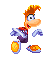
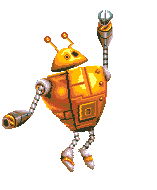

# Game discoveries

### General
- The `MechModel` function array, which defines the movement of an actor, has the function accidentally `Mode7_SetAccelerationY_SetTargetSpeedY_ResetSpeedX` defined twice, leaving the `Mode7_SetAccelerationY_SetTargetSpeedY` function, which was meant to be used at the second place, unused. This would mess up with the actor movements if it was used, but no actors in Rayman 3 use this movement type.
- There are various message IDs which are unused. They are as follows:
    - 1000-1001
    - 1032
    - 1051-1052
    - 1071
    - 1092
    - 1094
    - 1096-1099
    - 1101
    - 1104-1109
- The `Scene2D` constructor for some reason disables the background scrolling for the first map of `Void of Bones`. This was added late during development judging by the prototypes.
- The sidescroller camera has some leftover code from either earlier games or the early production of this game. There's an unused camera state and some code that can never run due to the conditions not being met.
- The Mode7 camera has 3 unused states for a free-cam like mode. These were used in the early prototypes.
- In `AnimatedObject` there's a function called `FrameChannelSprite` which optimizes rendering an animation by deactivating sprite channels which are off-screen. There's however an issue - it's set to not update when the object is in delay mode (between two animation frames, which will happen if the animation runs at a lower framerate). This doesn't make sense since the object might move on screen even if the animation frame is the same, so it should always update. Because of this some sprites don't update to be on screen until a frame or two later, which is noticeable in the bosses when they move onto the screen.
- When rendering animations with rotation and scaling enabled then the individual flip flags for the sprite channels are ignored. This is usually not an issue, however some sprites, like the tree trunks in the waterski levels, are set to be horizontally flipped, which then gets ignored.
- When initializing `AObjectChain`, used to create chained animations for actors such as the caterpillars, it has a bug when allocating an array. It sets the size to the number of children when it's supposed to be one more than that since the main parent object is also included. This however doesn't cause any issue in the game since the number of children is always 6, and due to memory alignment it ends up allocating 8 bytes then.
- For some reason the animations for the Caterpillar enemy is referenced from the root resource table, yet it's never used from there.
- The order of the levels ids from the curtains in the hub worlds reflect the original order rather than the order they appear in the final game.
- The Single Pak multiplayer mode normally downloads a compressed ROM into WRAM and plays from that. However there still exists uncompressed code for the Single Pak mode in the normal ROM which appears to be an earlier version of it, perhaps for testing it without the connectivity (since the code is missing that part, among other things).

### Sounds
- The music `lyfreeVOX4` is unused and has no corresponding sound event.
- The sound effects `OnoEfor1_Mix02`, `Propulse_Combust1_Mix02` and `Curtain2_YoyoMove_Mix02` are unused, along with their corresponding sound events.

### Actors
Most actors have the first animation be unused and just single frame, most likely for their level editor. This is not included when mentioning unused animations for each actor.

#### Rayman
- In the N-Gage version the palette used for the flags is wrong when in teams mode as the palette doesn't match the sprite data. This causes the flags to render incorrectly.
- There's a timer value for you not being able to attack. This is however never set, thus making it unused.
- There's an unused flag which is only ever set to false during initialization.
- There's an unused flag which is only ever set to false for if the knockback from taking damage should insta-kill you.
- There's a flag for if the knockback from taking damage should be smaller and without resetting the speed which is only ever used when the flames in the Rocky boss fight damage you.. Once this has been set it does however not get unset, making it stay until a new level is loaded.
- There's an unused function that checks if you're moving downwards.
- There's a function which checks if the current level has lava in it, used to determine the drowning animation. This however includes two levels which don't have lava, those being `Den of Rocky` and the first part of `Heart of the Ancients`, as well a Mode7 map which doesn't even use the Rayman actor, that being `Magma Mayhem 2`. It also forgets to include the third GameCube bonus level, making it not show the lava splash when drowning.
- The N-Gage version has an unused item which would make arrows appear on the screen, pointing towards the other players. The code for these arrows is fully implemented and there are animations for them too, with the color changing based on the player:

- There are various unused message handlers:
    - Message 1015 would have been used for collecting a big yellow lum and increases the lums count by 10.
    - Message 1017 sets the state to an otherwise unused one where Rayman plays the victory animation and then returns to the default state.
    - Message 1018 sets the state to an otherwise unused one where Rayman plays the determined animation and then returns to the default state.
    - Message 1045 does the same as message 1025, used when Rayman takes damage.
    - Message 1072 sets the state for an otherwise unused one where Rayman is hidden on the screen. This gets called from the flying shell actor, but since the Rayman actor isn't in that level it never gets received.
- When taking damage and on a plum the game incorrectly sets the linked movement actor to null rather than the attached object (the plum in this case). However it doesn't cause any issues since the attached object gets overridden later on anyway and the linked movement actor already being null.
- If attacking while shocked then Rayman gets stuck in the state which might soft-lock the game. This was fixed in the N-Gage version.
- When entering a level curtain by pressing the A button Rayman will begin entering the jump state, causing the jump sound to play even if you don't jump.
- If charging your fist while sliding then the sliding sound keeps playing even if you're not moving.
- The first state of the actor sets it to an action which plays an animation for spawning into the level. This however gets overridden before it has a chance to play, making it go unused.

- Actions 48, 49, 60, 61, 98, 99, 119, 120, 150, 151, 171, 172, 192, 207 and 208 are unused. That makes the following animations also unused:

- The following animations are completely unused:

- The following animations are completely unused and empty in the final game (most have animations in the prototypes): 9, 51, 52, 53, 54, 55, 56, 57, 58, 73, 76, 77, 78, 79, 81, 86, 125, 153, 155, 156, 157, 160.
- There's a bug where if you look up while the grimace animation is playing then the sound effect for it will keep looping.
- In the GBA version only there is a bug where if you charge an attack while hanging then the charging sound will play twice, making it sound louder than usual.
- In multiplayer your movement speed is determined by different conditions based on the game type. In the `Tag` and `Burglar` modes it depends on if you have the tag, while in the N-Gage exclusive `Capture the Flag` mode it depends on if you have the flag. There's however a bug in the climbing state where it checks for the tag even in the `Capture the Flag` mode.
- There's a bug in the code where it uses the wrong variable for a condition. This results in you moving away from the purple lum very slowly if you start swinging very close to it.
- If you're carrying an object, such as a keg, and stop moving right as you fall from a ledge then the game will crash. This is because the game checks for if you've let go of the directional buttons first, making it move into the wrong state. In this state it still references the object you were carrying, which is now null as Rayman let go of it when falling.
- The state function for throwing an object doesn't have proper null checks for the object you're throwing, making it sometimes try to write values to invalid memory regions (which just get discarded). This was fixed in the N-Gage version since it would cause a crash there.
- When ending the current map the game gets the current `Frame` instance, assumes it's of type `FrameSideScroller`, and sets the flags for if you can pause the game and if the timer is running to false. The problem is that in the hub worlds the type is `FrameWorldSideScroller`, meaning that it then writes to out of bounds memory instead. The same thing happens when dying, although you can't die in the hub worlds so it doesn't matter there.
- When transition out from the current map there is a check for if you're on the worldmap. This is unused since the Rayman actor does not appear there.
- When knocked back from taking a hit there is no null check for the object that hit you, which is used to determine the direction to get knocked back to. However it doesn't seem the object can ever be null, so it shouldn't matter. Still a null check was added to the N-Gage version.
- If climbing when knocked back from getting hit then a flag is set. After 25 frames this flag is meant to be cleared, allowing you to climb again, thus making you not fall too far. However the code is bugged and won't ever set the flag to false.
- There are 4 unused states:
    - The first one sets an action which plays the animation for when finishing a level, and then returns to the default state once it has finished. It also plays the win sound.
    - The second one sets an action which plays an otherwise unused animation which is similar to the one for when fighting a boss. Then it returns to the default state. The makes the animation unused:

    

    - The third one hides Rayman.
    - The fourth one sets an action which plays the animation for when getting a new power, and then returns to the default state once it has finished. It also plays the win sound.

#### BoulderMode7
- The boulder sprite rotates either left or right depending on its direction. It however doesn't take the camera into account, meaning that the rotating will only look correct from one direction. This is very noticeable as several of the boulders will look as if they're rotating in the opposite direction from where they're moving.

#### LumsMode7
- Due to this being the only Mode7 actor to use affine rendering while also having an animation it causes it to mis-align when scaled. This is noticeable the further away the lum is with it then appearing to jump between two points during the animation.
- The blue lums, which give you a boost, are only found in the multiplayer mode. However there is unused code to handle them in single player too. This was used in the early prototypes.

#### MissileMode7
- The actor checks if it hits the main actor, and insta-kills itself if so. However this is the main actor and it also doesn't have the hitboxes defined to perform this check.
- When checking for if you've let go of the accelerate button it calls `IsButtonJustReleased`, which should never be used during gameplay. That's because if you pause while the button is held down and then let go while paused it will never register by the actor. This causes it to keep thinking you're holding the button down.
- During multiplayer you can spectate other players after dying. You switch between players by pressing A, which causes the screen to fade out before moving the camera. The timing is however wrong, as the fade out lasts 32 frames while the camera moves after 16 frames. This makes the transition between players very jarring.

#### RaymanMode7
- The actor checks if it hits the main actor, and insta-kills itself if so. However this is the main actor and it also doesn't have the hitboxes defined to perform this check.
- There's an unused function which kills you if you're touching insta-kill collision.
- There is some leftover code from how the Murfy tutorial box used to be triggered.
- There's an animation bug that occurs during the same frame that you hit the water after jumping (first frame of it switching from the jumping animation) where Rayman's sprites will be all messed up. This is due to how the game updates the animations here which causes it to not correctly account for if the animation is in "delay mode", thus making it not load the correct graphics for the new animation.

#### BluePirate
- The actor can optionally be configured to drop a red lum after being defeated, but this is never used.

#### Caterpillar
- There is unused code to handle the caterpillar dying if hit by another caterpillar.

#### Electricity
- The following animations are unused:

- One of the hitboxes for the big variant when facing left is misaligned. This is due to the code not correctly flipping the hitbox, making it appear more to the right than it should.

#### FlyingBomb
- Action 8 is unused. It's only defined for the helicopter bombs and is always the same as action 6.
- The actor is hard-coded to immediately destroy one of the actors in the first map of `River of Fire` (instance ID 63) and modify one of the actors in the first map of `The Underlands` (instance ID 68) to be stationary rather than moving.

#### GreenPirate
- The actor can optionally be configured to drop a red lum after being defeated, but this is never used.

#### Grolgoth
- For some reason the Grolgoth is added as an actor to most maps in the game even though he doesn't appear. This even includes some Mode7 maps and the worldmap where he wouldn't function anyway. By looking at the prototypes it seems he was progressively added to more and more maps towards the end. The initialization code was later updated to handle him being in a non-boss map, although it doesn't do anything besides force him to transition to the state of being on the ground, like in the first map of the final boss. There is oddly also a check in the code for if the current map is the second map of `The Mettleworks`, in which case he's set to always instantly kill Rayman on touch rather than just deal damage.
- Actions 2, 3, 4, 5, 23, 24, 26, 56, 57 and 59 are unused. That makes the following animations also unused:

- There is an unused attack function where a big exploding bomb spawns at a random point on the map (with it having a check to make sure it's not too close to Rayman). This was most likely meant to appear in the second map of the final boss.
- There is an unused state for the Grolgoth being in the air and using action 59 or 26 (depending on the direction) before transitioning back to the default air state.

#### Hoodstormer
- There is an unused state that uses the unused actions 4 and 5. It appears to have been a state where the enemy taunts Rayman if out of reach. That makes the following animation also unused:

#### Jano
- Action 8 is unused. That makes the following animation also unused:

#### JanoSkullPlatform
- Actions 4, 6 and 7 are unused. Action 4 has the solid version of the platform moving to the left (in the game it only moves to the right). Actions 6 and 7 have the platform move upwards and downwards respectively. Additionally there are 4 unused animations for this actor due to it using the same animations as the normal Skull actor.

#### Machine
- There are 5 unused animations, but three of them just have the cannon not moving, one is empty and the last is nearly identical to the animation of the cannon shaking.
- When defeated the actor has a table of position offsets to use for the explosion effects. This table has 10 entries, yet only 8 are used. Several of the X positions are also unused due to it updating the X position less often than the Y position.
- There is unused code for showing the Murfy help text if hit by a bomb.
- When the small cog gets hit and falls down it uses the wrong size, making it suddenly appear bigger. That's because of the state for the cog falling only sets the size for the other cogs, leaving that one at the default size.

#### MetalShieldedHoodboom
- There is a boolean value which determines if the actor should start its attack quicker than normal. This value is only ever set to false and thus remains unused.

#### RedPirate
- Actions 4, 5, 6, 7, 8, 9, 16, 17, 26 and 27 are unused. That makes the following animations also unused:

- Like many enemy actors which shoot projectiles, this one has a value to keep track of how many shots it has left to shoot in the current attack cycle. This value is however only set, and never checked for, and thus remains unused.

#### RedShell
- The red shell has 3 states it can be initially set to, but only one of them is actually used. The unused ones are one where it walks towards you instead of charging and another one where it's first sleeping and then flies up. That makes the following animations unused:

- Additionally there is a completely unused animation of the shell turning around:

- Actions 14 and 15 are unused, but they both use an existing animation.

#### Rocky
- The blue lum only makes a sparkling sound the first time it appears. This is probably an oversight.
- Actions 20 and 21 are unused. That makes the following animation unused:

- The actor initializes to a state where it plays a sleeping animation until Rayman comes close enough. However Rayman spawns within the distance it checks, meaning that you never get to see this state. That makes the following animation unused:

#### Scaleman
- There is a boolean value which determines if the camera should be centered. This value is only ever set to true and thus remains unused.
- The following animations are unused:

- There's a bug in the code for the shadow when the Scaleman lands on the ground. The shadow animation of it shrinking should change to an animation where it's stationary, but the incorrect function is used, referencing the `Actor` as an `AnimatedObject`, thus causing it to never run. This makes the shadow animation keep looping, which is noticeable for a few frames as the Scaleman lands.

#### SilverPirate
- The actor can optionally be configured to drop a red lum after being defeated, but this is never used.

#### Spider
- The two places where the chasing variant of the spider appear have the two captor trigger boxes spaced a bit apart, making it possible to trigger the first one (to activate the spider) without triggering the second one (to spawn the spider). This causes the spider to stay frozen in its spawn spot. However, the spider won't actually be visible due to the sprite framing optimization (deactivating off-screen sprites) hiding the spider and then not updating again until the spider is spawned. The chase music will still trigger when nearby though, and punching where the spider is will block the fist.
- The boolean value indicating if the spider should jump is not initialized, meaning it defaults to the default allocation values, which is 0xCD and seen as being true (non-zero). Because of this the spider jumps immediately after spawning.
- Actions 2, 3, 4, 5, 6, 7, 15, 23, 25, 26, 29 and 30 are unused. They all use existing animations, except for two of them which use an animation of the spider being completely still and not moving.
- There's an impossible state transition condition in the chasing state. Similarly there's a state transition condition in another state that'll always be true. These are either leftovers from earlier versions of the game or unintentional mistakes.

#### SpikyFlyingBomb
- The flying bomb has 3 states it can be initially set to, with one of them being unused. It has the flying bomb behave like a mine bomb, targeting the player and moving towards it in a straight line. That makes actions 4 and 6 unused, but they both use existing animations.
- Action 7 is unused, but it uses an existing animation.

#### Spinneroo
- Actions 4, 5, 8 and 9 are unused, with the last two using an unused animation. That makes the following animation unused:

- Additionally there are 2 completely unused animation:

- There are 2 unused states which use the unused actions. No special code besides that exist in the states though.

#### Ammo
- The actor is unused. It's meant to appear in the final boss and give you ammo to shoot from the flying shell as it does in the ETSC prototype.
- There is a value that saves the initial Y position. This goes unused as when the ammo respawns it sets a random Y position from a list, ignoring the initial one.
- The timer value for when it respawns is not initialized, meaning it defaults to the default allocation values, which is 0xCD. This would be an issue if not for the fact that it's stored as a byte, meaning it'll quickly wrap back down to 0 again and function like normal.

#### Arrive
- There are 3 unused animations, but they're all empty.

#### Barrel
- The barrel can optionally be set to break on impact rather than float in the water. This is unused in the final game and was meant to be used to block your path between the first and second levels in the first hub world, as seen in the prototypes. In the final game the animations for these states are broken.
- There are 3 unused animations. 2 of them just have the barrel standing still without moving, while the third one has it bouncing around while floating:

#### BlackLum
- The black lum can optionally be linked to a red lum which spawns after having been defeated. This is however never used.
- There is a boolean value which determines if the actor should be drawn (i.e. not hidden). This value is only ever set to true and thus remains unused.

#### Boulder
- There is code to manage the boulder's hitbox before it spawns, which is unused since it doesn't have an attack hitbox yet then. The code here oddly makes it damage any actor it comes into contact with and not just the main actor as it does after spawning.

#### CaptureTheFlagFlag
- There is an unused value that gets set to null and then never used again.
- When displaying after being dropped it saves the original palette ID so it can be restored afterwards. This however serves no purpose since the flag is only ever drawn on screen when dropped. While being carried by a player it is part of Rayman's sprite animations instead.
- When dropped the flag is set to always use palette ID 1. This corresponds to the second palette for player 1, used for Rayman's body, and is incorrect for the flag, making it render incorrectly. Instead it should be using palette ID 0, the first palette for player 1, to correctly render as a red flag. In order to render as a colored flag, in teams mode, it instead has to use the third palette of the player that picked up the flag.

#### CaptureTheFlagFlagBase
- There are 3 unused animations of the base without the flag. In the game it removes the flag from the normal animations by hiding its animation channel instead of playing a different animation.

- There is an unused value for the current team id in teams mode. This is only ever set.

#### CaptureTheFlagItems
- Action 2 is unused and would have been used for an item that makes arrows appear on the sides of the screen, pointing to the other players. An animation exists for this item, but it appears to be using the wrong sprites:

- When the item is collected by a player it sends a message to the player actor with the item type and duration it should last for. The duration is determined from a table with a value for each type. However each value in this table is set to 300, making it completely unnecessary.

#### Depart
- There's an action where the signpost is facing to the right. Using this makes the signpost end the level rather than exit from it.
- There is 1 unused animation:

#### Explosion
- The `ProcessMessage` function is overridden, yet no messages are checked for.

#### FlyingShell
- There are 2 unused animations, but they're just the shell not moving, with one of them having broken graphics.
- There is unused code for using ammo and firing energy shots. This was used in the ETSC prototype.
- There's an initialization state for the shell which immediately transitions to the flying state and then also sends a message to the main actor to hide. However the main actor is the shell itself, and it doesn't check for the hide message. This seems to suggest that originally the Rayman actor was meant to appear in these levels, perhaps having you mount the shell before flying with it.
- When finishing the map the actor is missing the code for saving the game like all main actors should have. Due to this the game never saves that you've beaten the final boss, making the level text always remain in white and not allowing all GameCube bonuses to be unlocked.

#### Gate
- The actor can be initialized to requiring 1, 3 or 4 switches to have it open, yet only the variants with 1 or 4 switches are used.
- The gate can receive a message to close itself after having opened. This is never used. If this happens it also incorrectly plays the opening animation when closing, instead of the closing one.

#### ItemsMulti
- The state function is incorrectly implemented, having the same code run no matter if the state is in the `Init`, `Step` or `UnInit` mode. This causes the state code to run an extra time during initialization, which results in it using a null pointer to the `UserInfo` as it hasn't been created yet. In the N-Gage version a null check was added here to avoid crashing.
- When setting the action for items with a randomized action there is a bug in the code. It has a value to keep track of the last randomized action to avoid getting the same one twice in a row, but it assigns the wrong variable, making this system not work.

#### Keg
- There is 1 unused animation:

- Action 15 is unused, which makes the following animation also unused. It appears nearly identical to that which appears in the separate actor for the keg debris.

- When the keg respawns from the dispenser in the Garish Gears boss there is a bug in the code. It waits with respawning until the difference between its X position and the same X position is less than 180, which is always true. This was most likely meant to check the difference between its X position and that of the player.
- There is a bug with the falling keg where if there are multiple on screen at once then one keg can interrupt the falling sound for another keg.
- If you detach from the flying keg and survive before the sequence is finished then the flag for Rayman to let go of the keg will be stuck at being set, making you not able to pick up a new keg.

#### KegFire
- The actor is set up with actions for facing both right and left, yet it's hard-coded to only ever face right.

#### Lums
- There's an unused versions of the yellow lum that's bigger and is worth 10 lums when collected:

- The multiplayer states have leftover checks for big blue lums even if it's unused. The code isn't fully functional though and will set the wrong animation.

#### Murfy
- The N-Gage version has an additional boolean value which is set to true and never used again.
- While Murfy is talking to Rayman there is code checking for if you have moved away from Murfy or if you're attacking him, both of which are impossible to do. If it detects you attacking him then he will move out of the way to avoid the fist and then move back in.

#### MurfyStone
- When spawning in Murfy it sets Murfy to appear just outside of the screen above you. However it incorrectly uses the horizontal resolution to calculate this rather than the vertical one, meaning he gets set to further away than intended.
- There's an unused state that does nothing, suggesting that the stones would originally only have been interactable once and then not again.

#### PurpleLum
- There's unused code in the N-Gage version to handle the purple lums in multiplayer. They however don't appear in any of the multiplayer maps, making it unused. The code is also bugged, making it not work for all players.

#### RaymanWorldMap
- The actor appears in the worldmap, but is never used. It's probably just a placeholder since each scene needs a main actor.

#### Butterfly
- The following animations are not used in any level (there are 2 more, but they're identical to animations which are used):

#### Snail
- The actor is unused. It's meant to appear as a scenery element in the forest levels as seen in the Focus Test prototype.

#### Sparkle
- The following animations are not used in any level:

- The timer value for when it should show is not initialized, meaning it defaults to the default allocation values, which is 0xCD.

#### SwingSparkle
- There's a bug causing the sparkles to sometimes show at the wrong position during the first frame. This due to the position of each sparkle being retained from the last time they were shown, and them not being updated until the next frame. However, due to another bug, a lack of a null check, this isn't very common since the position value will usually have been set to random data from an invalid pointer.
- If Rayman is too far away from the purple lum when hitting it then the sparkles created won't be enough to reach the purple lum. This is because it only creates a certain amount of them and they start by going from Rayman's position. This also causes the sparkle with the fist animation not to be created either. It's easy to reproduce this glitch in the first hub world by charging your fist and hitting the purple lum from the right side of it.

#### Teensies
- There is an unused state it can be set to where it cycles between 2 random victory animations. That makes the following animations unused:

- Additionally the following idle animations are not used in any level:

- And finally the following animations are complete unused:

#### Urchin
- The actor cycles between the 3 available actions. However they're all identical, playing the same animation.
- There are 3 unused animations:

#### WalkingShell
- Actions 1, 6, 7 and 8 are unused. That makes the following animations also unused:

- There are 4 unused animations, not including 2 ones where the shell doesn't move:

- There's an unused behavior where you would need to boost while in a loop or else the shell wouldn't make it and fall off.
- This is one of the few actors that was quite substantially updated in the N-Gage version. It appears to have fixed various bugs with it.

#### Wall
- The actor is unused. It appears to be related to wall-jumping.

#### WaterSplash
- There is 1 unused animation:

#### BouncyPlatform
- The actor has an unused mode it can be set to where it reveals a trap after you bounce on it. That makes the following animations unused:

#### BreakableGround
- There's unused code in the N-Gage version to handle the actor in multiplayer. It however doesn't appear in any of the multiplayer maps, making it unused. Unlike in the single player levels it was meant to respawn after having been broken.

#### FallingNet
- Action 2 is unused. That makes the following animation also unused:

- There is 1 unused animation:

#### FallingPlatform
- Action 4 is unused. That makes the following animation for the chained variant also unused. The wooden variant doesn't have a unique animation for this action.

- There is an unused state of the platform beginning to fall. That makes action 2 unused and the animation it uses for the chained variant also unused. The wooden variant doesn't have a unique animation for this action.

#### MechanicalPlatform
- The platform is rather inconsistent with how it lands, meaning it doesn't always land on the same height from the ground as it starts. This subsequently causes a bug where the sound effect for it being fully raised only plays every second time. This is because the condition for the sound effect playing uses a direct equality check, which doesn't match if the start height is wrong.

#### MovingPlatform
- There is 1 unused animation for the wooden variant:

- The moving platform can be initialized to multiple different modes. 2 of these are unused. The first one makes the platform move with acceleration and deceleration, while the other one has no implementation.

#### Plum
- There is unused behavior for the plum landing on solid ground, making it bounce like Rayman 1 and allowing you to hit it so it can fall into the lava. It also supports bouncing on slopes.
- There is a bug where if you fall off a platform with the plum and it touches climbable collision then the plum plays the floating animation while in the air.

#### Skull
- There's an unused function which implements overriding `ProcessMessage` and handles the message for if an actor collides with another actor of the same type. This would have caused the skull to fall down, like it does in the Jano boss. This also makes action 11 and the falling down state unused.
- There's a state the skull can be initialized to which is not used in any level. It has it spin in place until hit, making it solid. That makes the following animations, which are broken in the final game, also unused

- There is 1 fully unused animation, which is broken in the final game:

#### UnusedBouncyPlatform
- The actor is unused. It appears to have allowed you to bounce on it, before it would become deadly and damage the player on contact.
- Action 1 is unused.

#### EnergyBall
- There is 1 unused animation:

- When checking for if the actor is off-screen, and thus despawning it, it hard-codes the vertical resolution to 160, even in the N-Gage version where it's supposed to be different.

#### FlowerFire
- There are 2 unused animations:

#### GrolgothProjectile
- There is a bug which causes the small bombs on the ground to vertically shake while moving. They're instead meant to fly up or down to get to the target height and then stop moving vertically.
- There is 1 unused animation:

#### JanoShot
- Like with the energy ball actor, when checking for if the actor is off-screen, and thus despawning it, it hard-codes the vertical resolution to 160, even in the N-Gage version where it's supposed to be different.

#### RaymanBody
- When drawing the actor it calls `PlayChannelBox` if the actor is not framed (not on screen). This is however unnecessary since it gets called when computing the next frame. This means it gets called twice each frame (which doesn't change anything).
- During multiplayer the actor doesn't change its palette, meaning that if you perform the body shot attack then the body part color might not match the color of Rayman. This was fixed in the N-Gage version.

### Dialogs
- The blue lums bar creates and plays an animation which is empty. This is most likely some leftover.
- The bar for the final boss has unused animations for the boss having 3 health:

- When you only have 1 hp left then the life bar is set to play a heartbeat sound effect every 64 frames. It uses the global timer to check for this. There's however a bug here, cause when pausing the game the global timer also pauses, meaning that if you pause at the exact frame as the sound is playing then it'll keep playing every frame.
- When you die it shows having 0 hp on the HUD. However for a few frames it will switch to showing having 5 hp instead. This is because each hp variation has two animations for the HUD, one with a sparkle (the first one it shows) and one without a sparkle (the one it shows after the sparkle one). However the 0 hp animation only has one variant, making it display the wrong animation after the first one.
- There are various animations for the HUD that are unused. They oddly include health indicators where the max health is 2 rather than 5, and a cage counter with space for two digits before the slash:

- The multiplayer HUD class `UserInfoMulti2D` has three unused variables which are only ever set and not read. It also has two unused functions. The first is `AddTime` which would add time to your clock, something which can't happen in the final game. The second one is `PrintInfo` which is mostly empty in the final game, but implemented in some of the earlier prototypes.
- The Mode7 multiplayer HUD class `UserInfoMultiMode7` has an unused text object which has the default text set as "Winner P1!". There's also a function that gets called for drawing the current time which is empty in the final game.
- The value for the current horizontal position of the birds in the waterski Mode7 levels is uninitialized, meaning it can start at any value. However this gets set to value between 0-255 after drawing the first frame, thus correcting any out of bounds values.

### Levels
- The N-Gage `Capture the Flag` levels have a boolean indicating if it's the first round of the match. This is however never checked against and is thus unused.
- The second map of `Wanderwood Forest` and both maps of `Shining Glade` have unused code for updating the water palette to give it a glowing effect. One color is however bugged, making parts appear red.
- The N-Gage exclusive level `Ascension` has 3 red pirate enemies which are spawned from captors. However they're incorrectly set to be enabled by default, even before being spawned, making you able to defeat some of them twice.
- In `Garish Gears` the hatch layer is misaligned in the N-Gage version, making it not cover the actual hatch.
- In the `Hoodlum Hideout` level there is code for spawning leaves which fall to the ground. The random range for the x-position is incorrectly hard-coded to 0-240 in the N-Gage version since the resolution is different there. The y-position also has a random range of 0-0, making the randomization pointless.
- In the first map of `Vertigo Wastes` the camera offset for the introduction sequence are all based on the GBA screen resolution, even in the N-Gage version. There's also a bug where it'll index out of bounds of an array, but it luckily doesn't cause any issues. This was fixed in the N-Gage version.
- In the first map of `The Underlands` there are some switches which spawn lums or bombs. These are set up so that there's a separate captor next to them which actually spawn the objects, with the switch being hard-coded to trigger the captor on activation based on the object ids. The way the game prevents the captors themselves from being triggered before the switch is activated is by manually disabling them in the level initialization based on their object ids. However, in the N-Gage version the object ids were changed, and this code no longer works. The level initialization code was entirely removed, while the code in the switch actor remains, but non-functional. Because of this the switches now no longer do anything, with the captors themselves being responsible for spawning the objects. This however causes an issue. There's an unused captor where there is no switch, probably a leftover from an earlier level design. This is linked to bombs which are already active by default. Because of this you can first hit the bombs to destroy them, and then re-spawn them by hitting the captor on the wall, causing the bombs to start moving to the left until they eventually hit a wall.
- In the first map of `Boulder Brink` there are leftover variables that get initialized for the lightning effect, even if it's not used in this map. In the second map, which does use the lightning effect, they forgot to update the code for the N-Gage version, where the effect is not used, causing graphical glitches to appear in the background when the lightning should appear. The vertical rain offset value is also not initialized (same is true for the fourth GameCube bonus level), meaning it can start at any value.
- In the `World Map` there's a visual bug where the clipping regions for the lightning isn't correctly positioned, making it leave small artifacts of the lightning based on which one is showing.
- For the sidescroller multiplayer maps it incorrectly defaults the variable keeping track of the currently invisible player to 0, which is the first player. This results in the fist being set to apply fading to it when spawned. However this doesn't do anything due to the sprite fading being globally disabled until an actor should actually be invisible.
- In the third GameCube bonus map it doesn't correctly handle the fading out when dying or finishing the map. This is because the map ID check incorrectly checks for map ID 3, rather than 2. Even if this did work it would however still be bugged! Cause the circle transition would then happen twice.
- In the fourth and seventh GameCube bonus levels it uses the floating skull effect in the background. They're meant to fade in and then out, which is handled from the code. However the level data here incorrectly defines this map as having alpha blending managed by the `TransitionsFX` system. This causes a conflict with the level-specific code, making the transparency be incorrect at the beginning of the level.
- In the fifth GameCube bonus level there is a lightning and rain effect. However unlike in `Boulder Brink` there is no check for if the game is paused. Because of this different glitched effects might show when pausing on specific frames during the lightning cycles. If you pause at the very first frame the screen turns white and the thunder sound effect keeps plying every frame.
- The worldmap has 3 unused animations for Rayman. One of them is however empty and another one is identical to another animation. The remaining one has Rayman standing at the entrance to the volcano, which is never shown in the game:

### Intro
- There is 1 unused animation for the logo without the black lum:

### Menu
- Some sound events are mistakenly called with the object parameter set to 0 instead of -1. This however doesn't cause any changes in the event processing since the object is only used when pan or roll-off are enabled for the event.
- Most animations which use `FrameChannelSprite` to deactivate off-screen sprite channels define the screen height as 255 instead of 160 for some reason. This doesn't cause any changes in the behavior as these animation do not appear at the bottom of the screen.
- When selecting the multiplayer mode on GBA there's a typo where "Burglar Mode" is spelt as "Buglar Mode". This was fixed in the N-Gage version.
- When selecting the multiplayer map the game animates the palette for the outline of the selected map to produce a glow effect. The code is however written in an odd way where it loops through the palette code 13 times, doing the exact same thing each time.
- The N-Gage uses the wrong state to transition out of certain multiplayer menu pages when a connection error occurs. This appears to be a copy-paste bug, where they copied code from another page without updating it.
