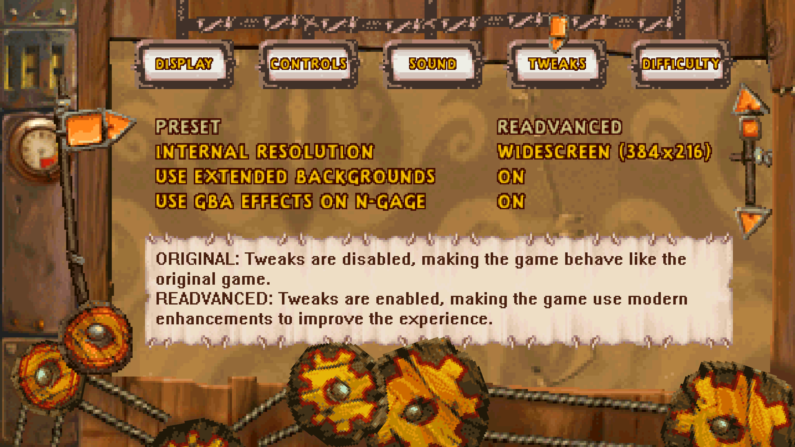

# Options

The options menu can be accessed from the new main menu and from the new pause dialog. Additionally the options can be manually edited in the `Data/Config.ini` file.

## Display

### Language
Sets the language used for the localized text in the game. The available languages will differ based on if it's the GBA or N-Gage versions.

### Display mode
- **Windowed:** Renders the game in a resizable window.
- **Fullscreen:** Renders the game in fullscreen, based on the selected resolution.
- **Borderless**: Renders the game in borderless fullscreen. The resolution is locked to the screen resolution.

### Fullscreen resolution
Sets the resolution to use when the display mode is set to fullscreen. The listed resolutions are the ones supporting by the current graphics adapter. A manual resolution can be set by manually editing the config file.

### Window resolution
Sets the window resolution factor, based on the internal resolution. The window size can also be freely set by resizing the window.

### Lock window aspect ratio
If enabled then manually resizing the window will automatically make sure it maintains the same aspect ratio as the internal resolution to avoid there being any black bars on the sides.

### Disable camera shake
If enabled then the camera shaking effect which is used in some parts of the game to indicate a big impact will be disabled. This can help for people who suffer from motion sickness.

## Controls

| Control | GBA button | N-Gage button | Menu description | Game description |
|---|---|---|---|---|
| Up | D-Pad Up | D-Pad Up | Navigate up | Look up |
| Down | D-Pad Down | D-Pad Down | Navigate down | Crouch |
| Right | D-Pad Right | D-Pad Right | Navigate right | Move right |
| Left | D-Pad Left | D-Pad Left | Navigate left | Move left |
| Jump/confirm | A | 5 | Confirm | Jump |
| Attack/back | B | 7 | Go back | Attack |
| Bodyshot/right | R | 8 | Navigate right | Bodyshot attack |
| Wall climb/left | L | 6 | Navigate left | Wall climb |
| Pause/select | Start | Left soft key | Confirm | Pause |
| Special/back | Select | Right soft key | Go back | Special (cheat codes) |
| Debug: Debug mode |  |  | Toggle debug mode | Toggle debug mode |
| Debug: Pause |  |  | Pause/resume engine | Pause/resume engine |
| Debug: Step one frame |  |  | Pause engine and step one frame | Pause engine and step one frame |
| Debug: Speed up |  |  | Run engine in 4x speed | Run engine in 4x speed |
| Debug: Display hit-boxes |  |  |  | Toggle displaying object hit-boxes |
| Debug: Display collision |  |  |  | Toggle displaying physical tile collision |
| Debug: No-clip |  |  |  | Toggle no-clip (speed up with jump button) |

## Sound

### Music volume

Change the volume for the music, between 0 and 10.

### Sound fx volume

Change the volume for the sound effects, between 0 and 10.

### Play music when paused

- **Original:** Keeps the original behavior based on platform. This is having the music keep playing for the N-Gage version while having it pause for the GBA version.
- **Yes:** Music keeps playing when pausing the game.
- **No:** Music pauses when pausing the game.

### Disable low health sound

If enabled then the game doesn't play the sound effect for when you only have 1 hit-point left.

## Tweaks

*TODO: Document these options*

## Difficulty

*TODO: Document these options*

## Debug

*TODO: Document these options*
