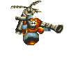
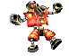
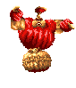
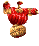

# Discoveries

### General
- The `MechModel` function array, which defines the movement of an actor, has the function accidentally `Mode7_SetAccelerationY_SetTargetSpeedY_ResetSpeedX` defined twice, leaving the `Mode7_SetAccelerationY_SetTargetSpeedY` function, which was meant to be used at the second place, unused. This would mess up with the actor movements if it was used, but no actors in Rayman 3 use this movement type.
- There are various message IDs which are unused. They are as follows:
    - 1000-1001
    - 1032
    - 1051-1052
    - 1071
    - 1092
    - 1094
    - 1096-1099
    - 1101
    - 1104-1109
- The `Scene2D` constructor for some reason disables the background scrolling for the first map of `Void of Bones`. This was added late during development judging by the prototypes.
- The Mode7 camera has 3 unused states for a free-cam like mode. These were used in the early prototypes.

### Actors
Most actors have the first animation be unused and just single frame, most likely for their level editor. This is not included when mentioning unused animations for each actor.

#### BoulderMode7
- The boulder sprite rotates either left or right depending on its direction. It however doesn't take the camera into account, meaning that the rotating will only look correct from one direction. This is very noticeable as several of the boulders will look as if they're rotating in the opposite direction from where they're moving.

#### LumsMode7
- Due to this being the only Mode7 actor to use affine rendering while also having an animation it causes it to mis-align when scaled. This is noticeable the further away the lum is with it then appearing to jump between two points during the animation.
- The blue lums, which give you a boost, are only found in the multiplayer mode. However there is unused code to handle them in single player too. This was used in the early prototypes.

#### MissileMode7
- When checking for if you've let go of the accelerate button it calls `IsButtonJustReleased`, which should never be used during gameplay. That's because if you pause while the button is held down and then let go while paused it will never register by the actor. This causes it to keep thinking you're holding the button down.
- During multiplayer you can spectate other players after dying. You switch between players by pressing A, which causes the screen to fade out before moving the camera. The timing is however wrong, as the fade out lasts 32 frames while the camera moves after 16 frames. This makes the transition between players very jarring.

#### RaymanMode7
- There's an unused function which kills you if you're touching insta-kill collision.
- There is some leftover code from how the Murfy tutorial box used to be triggered.
- There's an animation bug that occurs during the same frame that you hit the water after jumping (first frame of it switching from the jumping animation) where Rayman's sprites will be all messed up. This is due to how the game updates the animations here which causes it to not correctly account for if the animation is in "delay mode", thus making it not load the correct graphics for the new animation.

#### BluePirate
- The actor can optionally be configured to drop a red lum after being defeated, but this is never used.

#### Caterpillar
- There is unused code to handle the caterpillar dying if hit by another caterpillar.

#### Electricity
- The following animations are unused:

- One of the hitboxes for the big variant when facing left is misaligned. This is due to the code not correctly flipping the hitbox, making it appear more to the right than it should.

#### FlyingBomb
- Action 8 is unused. It's only defined for the helicopter bombs and is always the same as action 6.
- The actor is hard-coded to immediately destroy one of the actors in the first map of `River of Fire` (instance ID 63) and modify one of the actors in the first map of `The Underlands` (instance ID 68) to be stationary rather than moving.

#### GreenPirate
- The actor can optionally be configured to drop a red lum after being defeated, but this is never used.

#### Grolgoth
- For some reason the Grolgoth is added as an actor to most maps in the game even though he doesn't appear. This even includes some Mode7 maps and the worldmap where he wouldn't function anyway. By looking at the prototypes it seems he was progressively added to more and more maps towards the end. The initialization code was later updated to handle him being in a non-boss map, although it doesn't do anything besides force him to transition to the state of being on the ground, like in the first map of the final boss. There is oddly also a check in the code for if the current map is the second map of `The Mettleworks`, in which case he's set to always instantly kill Rayman on touch rather than just deal damage.
- Actions 2, 3, 4, 5, 23, 24, 26, 56, 57 and 59 are unused. That makes the following animations also unused:

- There is an unused attack function where a big exploding bomb spawns at a random point on the map (with it having a check to make sure it's not too close to Rayman). This was most likely meant to appear in the second map of the final boss.
- There is an unused state for the Grolgoth being in the air and using action 59 or 26 (depending on the direction) before transition back to the default air state.

#### Hoodstormer
- There is an unused state that uses the unused actions 4 and 5. It appears to have been a state where the enemy taunts Rayman if out of reach. That makes the following animation also unused:

#### Jano
- Action 8 is unused. That makes the following animation also unused:

#### JanoSkullPlatform
- Actions 4, 6 and 7 are unused. Action 4 has the solid version of the platform moving to the left (in the game it only moves to the right). Actions 6 and 7 have the platform move upwards and downwards respectively. Additionally there are 4 unused animations for this actor due to it using the same animations as the normal Skull actor.

#### Machine
- There are 5 unused animations, but three of them just have the cannon not moving, one is empty and the last is nearly identical to the animation of the cannon shaking.
- When defeated the actor has a table of position offsets to use for the explosion effects. This table has 10 entries, yet only 8 are used. Several of the X positions are also unused due to it updating the X position less often than the Y position.
- There is unused code for showing the Murfy help text if hit by a bomb.
- When the small cog gets hit and falls down it uses the wrong size, making it suddenly appear bigger. That's because of the state for the cog falling only sets the size for the other cogs, leaving that one at the default size.

#### MetalShieldedHoodboom
- There is a boolean value which determines if the actor should start its attack quicker than normal. This value is only ever set to false and thus remains unused.

#### RedPirate
- Actions 4, 5, 6, 7, 8, 9, 16, 17, 26 and 27 are unused. That makes the following animations also unused:

- Like many enemy actors which shoot projectiles, this one has a value to keep track of how many shots it has left to shoot in the current attack cycle. This value is however only set, and never checked for, and thus remains unused.

#### RedShell
- The red shell has 3 states it can be initially set to, but only one of them is actually used. The unused ones are one where it walks towards you instead of charging and another one where it's first sleeping and then flies up. That makes the following animations unused:

- Additionally there is a completely unused animation of the shell turning around:

- Actions 14 and 15 are unused, but they both use an existing animation.

#### Rocky
- The blue lum only makes a sparkling sound the first time it appears. This is probably an oversight.
- Actions 20 and 21 are unused. That makes the following animation unused:

- The actor initializes to a state where it plays a sleeping animation until Rayman comes close enough. However Rayman spawns within the distance it checks, meaning that you never get to see this state. That makes the following animation unused:

#### Scaleman
- There is a boolean value which determines if the camera should be centered. This value is only ever set to true and thus remains unused.
- The following animations are unused:

- There's a bug in the code for the shadow when the Scaleman lands on the ground. The shadow animation of it shrinking should change to an animation where it's stationary, but the incorrect function is used, referencing the `Actor` as an `AnimatedObject`, thus causing it to never run. This makes the shadow animation keep looping, which is noticeable for a few frames as the Scaleman lands.

#### SilverPirate
- The actor can optionally be configured to drop a red lum after being defeated, but this is never used.

#### Spider
- The boolean value indicating if the spider should jump is not initialized, meaning it defaults to the default allocation values, which is 0xCD and seen as being true (non-zero). Because of this the spider jumps immediately after spawning.
- Actions 2, 3, 4, 5, 6, 7, 15, 23, 25, 26, 29 and 30 are unused. They all use existing animations, except for two of them which use an animation of the spider being completely still and not moving.
- There's an impossible state transition condition in the chasing state. Similarly there's a state transition condition in another state that'll always be true. These are either leftovers from earlier versions of the game or unintentional mistakes.

...
