# Discoveries

### General
- The `MechModel` function array, which defines the movement of an actor, has the function accidentally `Mode7_SetAccelerationY_SetTargetSpeedY_ResetSpeedX` defined twice, leaving the `Mode7_SetAccelerationY_SetTargetSpeedY` function, which was meant to be used at the second place, unused. This would mess up with the actor movements if it was used, but no actors in Rayman 3 use this movement type.
- There are various message IDs which are unused. They are as follows:
    - 1000-1001
    - 1032
    - 1051-1052
    - 1071
    - 1092
    - 1094
    - 1096-1099
    - 1101
    - 1104-1109
- The `Scene2D` constructor for some reason disables the background scrolling for the first map of `Void of Bones`. This was added late during development judging by the prototypes.
- The Mode7 camera has 3 unused states for a free-cam like mode. These were used in the early prototypes.

### Actors
Most actors have the first animation be unused and just single frame, most likely for their level editor. This is not included when mentioning unused animations for each actor.

#### BoulderMode7
- The boulder sprite rotates either left or right depending on its direction. It however doesn't take the camera into account, meaning that the rotating will only look correct from one direction. This is very noticeable as several of the boulders will look as if they're rotating in the opposite direction from where they're moving.

#### LumsMode7
- Due to this being the only Mode7 actor to use affine rendering while also having an animation it causes it to mis-align when scaled. This is noticeable the further away the lum is with it then appearing to jump between two points during the animation.
- The blue lums, which give you a boost, are only found in the multiplayer mode. However there is unused code to handle them in single player too. This was used in the early prototypes.

#### MissileMode7
- When checking for if you've let go of the accelerate button it calls `IsButtonJustReleased`, which should never be used during gameplay. That's because if you pause while the button is held down and then let go while paused it will never register by the actor. This causes it to keep thinking you're holding the button down.
- During multiplayer you can spectate other players after dying. You switch between players by pressing A, which causes the screen to fade out before moving the camera. The timing is however wrong, as the fade out lasts 32 frames while the camera moves after 16 frames. This makes the transition between players very jarring.

#### RaymanMode7
- There's an unused function which kills you if you're touching insta-kill collision.
- There is some leftover code from how the Murfy tutorial box used to be triggered.
- There's an animation bug that occurs during the same frame that you hit the water after jumping (first frame of it switching from the jumping animation) where Rayman's sprites will be all messed up. This is due to how the game updates the animations here which causes it to not correctly account for if the animation is in "delay mode", thus making it not load the correct graphics for the new animation.

#### BluePirate
- The actor can optionally be configured to drop a red lum after being defeated, but this is never used.

#### Caterpillar
- There is unused code to handle the caterpillar dying if hit by another caterpillar.

#### Electricity
- The following animations are unused:

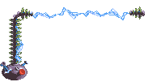
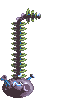

- One of the hitboxes for the big variant when facing left is misaligned. This is due to the code not correctly flipping the hitbox, making it appear more to the right than it should.

#### FlyingBomb
- Action 8 is unused. It's only defined for the helicopter bombs and is always the same as action 6.
- The actor is hard-coded to immediately destroy one of the actors in the first map of `River of Fire` (instance ID 63) and modify one of the actors in the first map of `The Underlands` (instance ID 68) to be stationary rather than moving.

#### GreenPirate
- The actor can optionally be configured to drop a red lum after being defeated, but this is never used.

#### Grolgoth
- For some reason the Grolgoth is added as an actor to most maps in the game even though he doesn't appear. This even includes some Mode7 maps and the worldmap where he wouldn't function anyway. By looking at the prototypes it seems he was progressively added to more and more maps towards the end. The initialization code was later updated to handle him being in a non-boss map, although it doesn't do anything besides force him to transition to the state of being on the ground, like in the first map of the final boss. There is oddly also a check in the code for if the current map is the second map of `The Mettleworks`, in which case he's set to always instantly kill Rayman on touch rather than just deal damage.
- Actions 2, 3, 4, 5, 23, 24, 26, 56, 57 and 59 are unused. That makes the following animations also unused:

- There is an unused attack function where a big exploding bomb spawns at a random point on the map (with it having a check to make sure it's not too close to Rayman). This was most likely meant to appear in the second map of the final boss.
- There is an unused state for the Grolgoth being in the air and using action 59 or 26 (depending on the direction) before transitioning back to the default air state.

#### Hoodstormer
- There is an unused state that uses the unused actions 4 and 5. It appears to have been a state where the enemy taunts Rayman if out of reach. That makes the following animation also unused:

#### Jano
- Action 8 is unused. That makes the following animation also unused:

#### JanoSkullPlatform
- Actions 4, 6 and 7 are unused. Action 4 has the solid version of the platform moving to the left (in the game it only moves to the right). Actions 6 and 7 have the platform move upwards and downwards respectively. Additionally there are 4 unused animations for this actor due to it using the same animations as the normal Skull actor.

#### Machine
- There are 5 unused animations, but three of them just have the cannon not moving, one is empty and the last is nearly identical to the animation of the cannon shaking.
- When defeated the actor has a table of position offsets to use for the explosion effects. This table has 10 entries, yet only 8 are used. Several of the X positions are also unused due to it updating the X position less often than the Y position.
- There is unused code for showing the Murfy help text if hit by a bomb.
- When the small cog gets hit and falls down it uses the wrong size, making it suddenly appear bigger. That's because of the state for the cog falling only sets the size for the other cogs, leaving that one at the default size.

#### MetalShieldedHoodboom
- There is a boolean value which determines if the actor should start its attack quicker than normal. This value is only ever set to false and thus remains unused.

#### RedPirate
- Actions 4, 5, 6, 7, 8, 9, 16, 17, 26 and 27 are unused. That makes the following animations also unused:

- Like many enemy actors which shoot projectiles, this one has a value to keep track of how many shots it has left to shoot in the current attack cycle. This value is however only set, and never checked for, and thus remains unused.

#### RedShell
- The red shell has 3 states it can be initially set to, but only one of them is actually used. The unused ones are one where it walks towards you instead of charging and another one where it's first sleeping and then flies up. That makes the following animations unused:

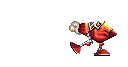
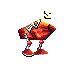

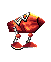

- Additionally there is a completely unused animation of the shell turning around:

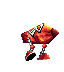

- Actions 14 and 15 are unused, but they both use an existing animation.

#### Rocky
- The blue lum only makes a sparkling sound the first time it appears. This is probably an oversight.
- Actions 20 and 21 are unused. That makes the following animation unused:

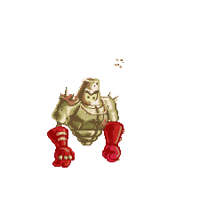

- The actor initializes to a state where it plays a sleeping animation until Rayman comes close enough. However Rayman spawns within the distance it checks, meaning that you never get to see this state. That makes the following animation unused:

#### Scaleman
- There is a boolean value which determines if the camera should be centered. This value is only ever set to true and thus remains unused.
- The following animations are unused:

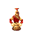

- There's a bug in the code for the shadow when the Scaleman lands on the ground. The shadow animation of it shrinking should change to an animation where it's stationary, but the incorrect function is used, referencing the `Actor` as an `AnimatedObject`, thus causing it to never run. This makes the shadow animation keep looping, which is noticeable for a few frames as the Scaleman lands.

#### SilverPirate
- The actor can optionally be configured to drop a red lum after being defeated, but this is never used.

#### Spider
- The boolean value indicating if the spider should jump is not initialized, meaning it defaults to the default allocation values, which is 0xCD and seen as being true (non-zero). Because of this the spider jumps immediately after spawning.
- Actions 2, 3, 4, 5, 6, 7, 15, 23, 25, 26, 29 and 30 are unused. They all use existing animations, except for two of them which use an animation of the spider being completely still and not moving.
- There's an impossible state transition condition in the chasing state. Similarly there's a state transition condition in another state that'll always be true. These are either leftovers from earlier versions of the game or unintentional mistakes.

#### SpikyFlyingBomb
- The flying bomb has 3 states it can be initially set to, with one of them being unused. It has the flying bomb behave like a mine bomb, targeting the player and moving towards it in a straight line. That makes actions 4 and 6 unused, but they both use existing animations.
- Action 7 is unused, but it uses an existing animation.

#### Spinneroo
- Actions 4, 5, 8 and 9 are unused, with the last two using an unused animation. That makes the following animation unused:

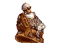

- Additionally there are 2 completely unused animation:

- There are 2 unused states which use the unused actions. No special code besides that exist in the states though.

#### Ammo
- The actor is unused. It's meant to appear in the final boss and give you ammo to shoot from the flying shell as it does in the ETSC prototype.
- There is a value that saves the initial Y position. This goes unused as when the ammo respawns it sets a random Y position from a list, ignoring the initial one.
- The timer value for when it respawns is not initialized, meaning it defaults to the default allocation values, which is 0xCD. This would be an issue if not for the fact that it's stored as a byte, meaning it'll quickly wrap back down to 0 again and function like normal.

#### Arrive
- There are 3 unused animations, but they're all empty.

#### Barrel
- The barrel can optionally be set to break on impact rather than float in the water. This is unused in the final game and was meant to be used to block your path between the first and second levels in the first hub world, as seen in the prototypes. In the final game the animations for these states are broken.
- There are 3 unused animations. 2 of them just have the barrel standing still without moving, while the third one has it bouncing around while floating:

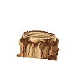

#### BlackLum
- The black lum can optionally be linked to a red lum which spawns after having been defeated. This is however never used.
- There is a boolean value which determines if the actor should be drawn (i.e. not hidden). This value is only ever set to true and thus remains unused.

#### Boulder
- There is code to manage the boulder's hitbox before it spawns, which is unused since it doesn't have an attack hitbox yet then. The code here oddly makes it damage any actor it comes into contact with and not just the main actor as it does after spawning.

#### CaptureTheFlagFlag
- There is an unused value that gets set to null and then never used again.
- When displaying after being dropped it saves the original palette ID so it can be restored afterwards. This however serves no purpose since the flag is only ever drawn on screen when dropped. While being carried by a player it is part of Rayman's sprite animations instead.
- When dropped the flag is set to always use palette ID 1. This corresponds to the second palette for player 1, used for Rayman's body, and is incorrect for the flag, making it render incorrectly. Instead it should be using palette ID 0, the first palette for player 1, to correctly render as a red flag. In order to render as a colored flag, in teams mode, it instead has to use the third palette of the player that picked up the flag.

#### CaptureTheFlagFlagBase
- There are 3 unused animations of the base without the flag. In the game it removes the flag from the normal animations by hiding its animation channel instead of playing a different animation.

- There is an unused value for the current team id in teams mode. This is only ever set.

#### CaptureTheFlagItems
- Action 2 is unused and would have been used for an item that makes arrows appear on the sides of the screen, pointing to the other players. An animation exists for this item, but it appears to be using the wrong sprites:

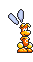

- When the item is collected by a player it sends a message to the player actor with the item type and duration it should last for. The duration is determined from a table with a value for each type. However each value in this table is set to 300, making it completely unnecessary.

#### Depart
- There's an action where the signpost is facing to the right. Using this makes the signpost end the level rather than exit from it.
- There is 1 unused animation:

#### Explosion
- The `ProcessMessage` function is overridden, yet no messages are checked for.

#### FlyingShell
- There are 2 unused animations, but they're just the shell not moving, with one of them having broken graphics.
- There is unused code for using ammo and firing energy shots. This was used in the ETSC prototype.
- There's an initialization state for the shell which immediately transitions to the flying state and then also sends a message to the main actor to hide. However the main actor is the shell itself, and it doesn't check for the hide message. This seems to suggest that originally the Rayman actor was meant to appear in these levels, perhaps having you mount the shell before flying with it.

#### Gate
- The actor can be initialized to requiring 1, 3 or 4 switches to have it open, yet only the variants with 1 or 4 switches are used.
- The gate can receive a message to close itself after having opened. This is never used. If this happens it also incorrectly plays the opening animation when closing, instead of the closing one.

#### ItemsMulti
- The state function is incorrectly implemented, having the same code run no matter if the state is in the `Init`, `Step` or `UnInit` mode. This causes the state code to run an extra time during initialization, which results in it using a null pointer to the `UserInfo` as it hasn't been created yet. In the N-Gage version a null check was added here to avoid crashing.

#### Keg
- There is 1 unused animation:

- Action 15 is unused, which makes the following animation also unused. It appears nearly identical to that which appears in the separate actor for the keg debris.

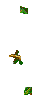

- When the keg respawns from the dispenser in the Garish Gears boss there is a bug in the code. It waits with respawning until the difference between its X position and the same X position is less than 180, which is always true. This was most likely meant to check the difference between its X position and that of the player.
- There is a bug with the falling keg where if there are multiple on screen at once then one keg can interrupt the falling sound for another keg.

#### KegFire
- The actor is set up with actions for facing both right and left, yet it's hard-coded to only ever face right.

#### Lums
- There's an unused versions of the yellow lum that's bigger and is worth 10 lums when collected:

- The multiplayer states have leftover checks for big blue lums even if it's unused. The code isn't fully functional though and will set the wrong animation.

#### Murfy
- The N-Gage version has an additional boolean value which is set to true and never used again.
- While Murfy is talking to Rayman there is code checking for if you have moved away from Murfy or if you're attacking him, both of which are impossible to do. If it detects you attacking him then he will move out of the way to avoid the fist and then move back in.

#### MurfyStone
- When spawning in Murfy it sets Murfy to appear just outside of the screen above you. However it incorrectly uses the horizontal resolution to calculate this rather than the vertical one, meaning he gets set to further away than intended.
- There's an unused state that does nothing, suggesting that the stones would originally only have been interactable once and then not again.

#### PurpleLum
- There's unused code in the N-Gage version to handle the purple lums in multiplayer. They however don't appear in any of the multiplayer maps, making it unused. The code is also bugged, making it not work for all players.

#### RaymanWorldMap
- The actor appears in the worldmap, but is never used. It's probably just a placeholder since each scene needs a main actor.

#### Butterfly
- The following animations are not used in any level:

#### Snail
- The actor is unused. It's meant to appear as a scenery element in the forest levels as seen in the Focus Test prototype.

#### Sparkle
- The following animations are not used in any level:

- The timer value for when it should show is not initialized, meaning it defaults to the default allocation values, which is 0xCD.

#### SwingSparkle
- There's a bug causing the sparkles to sometimes show at the wrong position during the first frame. This due to the position of each sparkle being retained from the last time they were shown, and them not being updated until the next frame. However, due to another bug, a lack of a null check, this isn't very common since the position value will usually have been set to random data from an invalid pointer.

#### Teensies
- There is an unused state it can be set to where it cycles between 2 random victory animations. That makes the following animations unused:

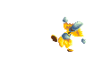

- Additionally the following idle animations are not used in any level:

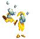

- And finally the following animations are complete unused:

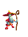

#### Urchin
- The actor cycles between the 3 available actions. However they're all identical, playing the same animation.
- There are 3 unused animations:

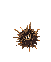

#### WalkingShell
- Actions 1, 6, 7 and 8 are unused. That makes the following animations also unused:

- There are 4 unused animations, not including 2 ones where the shell doesn't move:

- There's an unused behavior where you would need to boost while in a loop or else the shell wouldn't make it and fall off.
- This is one of the few actors that was quite substantially updated in the N-Gage version. It appears to have fixed various bugs with it.

#### Wall
- The actor is unused. It appears to be related to wall-jumping.

#### WaterSplash
- There is 1 unused animation:

#### BouncyPlatform
- The actor has an unused mode it can be set to where it reveals a trap after you bounce on it. That makes the following animations unused:

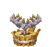

#### BreakableGround
- There's unused code in the N-Gage version to handle the actor in multiplayer. It however doesn't appear in any of the multiplayer maps, making it unused. Unlike in the single player levels it was meant to respawn after having been broken.

#### FallingNet
- Action 2 is unused. That makes the following animation also unused:

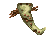

- There is 1 unused animation:

#### FallingPlatform
- Action 4 is unused. That makes the following animation for the chained variant also unused. The wooden variant doesn't have a unique animation for this action.

- There is an unused state of the platform beginning to fall. That makes action 2 unused and the animation it uses for the chained variant also unused. The wooden variant doesn't have a unique animation for this action.

#### MechanicalPlatform
- The platform is rather inconsistent with how it lands, meaning it doesn't always land on the same height from the ground as it starts. This subsequently causes a bug where the sound effect for it being fully raised only plays every second time. This is because the condition for the sound effect playing uses a direct equality check, which doesn't match if the start height is wrong.

#### MovingPlatform
- There is 1 unused animation for the wooden variant:

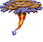

- The moving platform can be initialized to multiple different modes. 2 of these are unused. The first one makes the platform move with acceleration and deceleration, while the other one has no implementation.

#### Plum
- There is unused behavior for the plum landing on solid ground, making it bounce like Rayman 1 and allowing you to hit it so it can fall into the lava. It also supports bouncing on slopes.

#### Skull
- There's an unused function which implements overriding `ProcessMessage` and handles the message for if an actor collides with another actor of the same type. This would have caused the skull to fall down, like it does in the Jano boss. This also makes action 11 and the falling down state unused.
- There's a state the skull can be initialized to which is not used in any level. It has it spin in place until hit, making it solid. That makes the following animations, which are broken in the final game, also unused

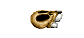

- There is 1 fully unused animation, which is broken in the final game:

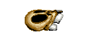

#### UnusedBouncyPlatform
- The actor is unused. It appears to have allowed you to bounce on it, before it would become deadly and damage the player on contact.
- Action 1 is unused.

...
